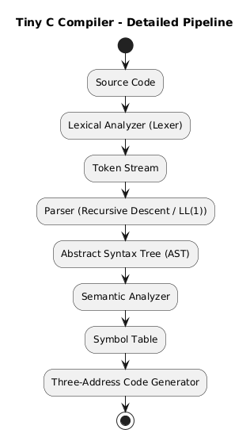
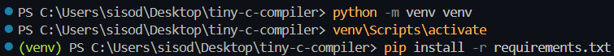
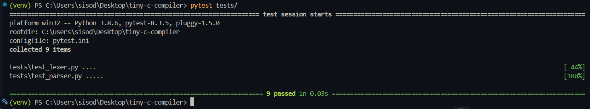
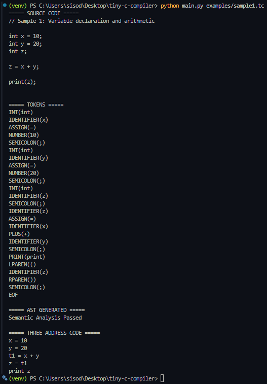
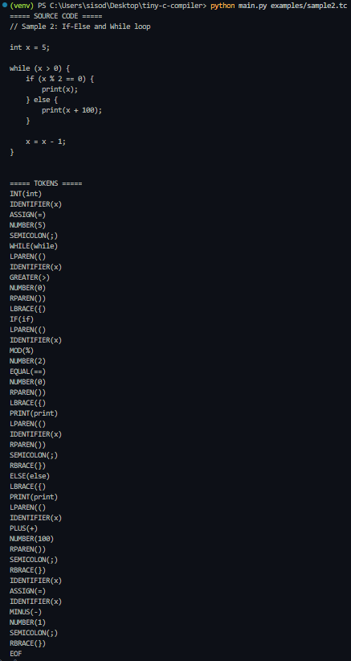
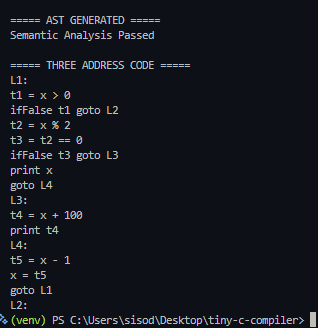

# Tiny C Compiler Front-End

A miniature compiler front-end for a C-like language built in Python.  
This project implements the core phases of a compiler including lexical analysis, parsing, abstract syntax tree (AST) generation, semantic analysis, and three-address intermediate code generation.

---

## 🚀 Features

- Variable declarations (`int x;`)
- Arithmetic expressions (`+ - * /`)
- Assignment statements
- If–else statements
- While loops
- Print statement (`print(x);`)
- Symbol table management
- Three-address code (TAC) generation
- Basic semantic error checking

---

## 🏗 Compiler Architecture



---

## 📁 Project Structure


---

## 🧾 Example Input (Tiny C Program)

```c
int x;
x = 5;

while (x > 0) {
    print(x);
    x = x - 1;
}
```

## 📤 Sample Generated Three-Address Code

```c
x = 5
L1:
if x <= 0 goto L2
print x
t1 = x - 1
x = t1
goto L1
L2:
```

## 📚 Grammar Overview

```wasm
program      → declaration_list
declaration  → "int" ID ";"

statement    → assignment
             | if_stmt
             | while_stmt
             | print_stmt

assignment   → ID "=" expr ";"

if_stmt      → "if" "(" expr ")" block ("else" block)?
while_stmt   → "while" "(" expr ")" block

print_stmt   → "print" "(" expr ")" ";"

block        → "{" statement_list "}"

expr         → term ((+|-) term)*
term         → factor ((*|/) factor)*
factor       → NUMBER | ID | "(" expr ")"

```

## 🛠 Concepts Implemented

- Lexical Analysis
- Recursive Descent Parsing
- Abstract Syntax Tree Construction
- Symbol Table Implementation
- Semantic Analysis
- Intermediate Representation (Three-Address Code)
- Control Flow Handling with Labels

## ⚙️ How to Run

### Setup Virtual Environment



### Run the Tests



### Finally, run this file 
```bash
python main.py examples/sample1.tc
```
#### Outputs




